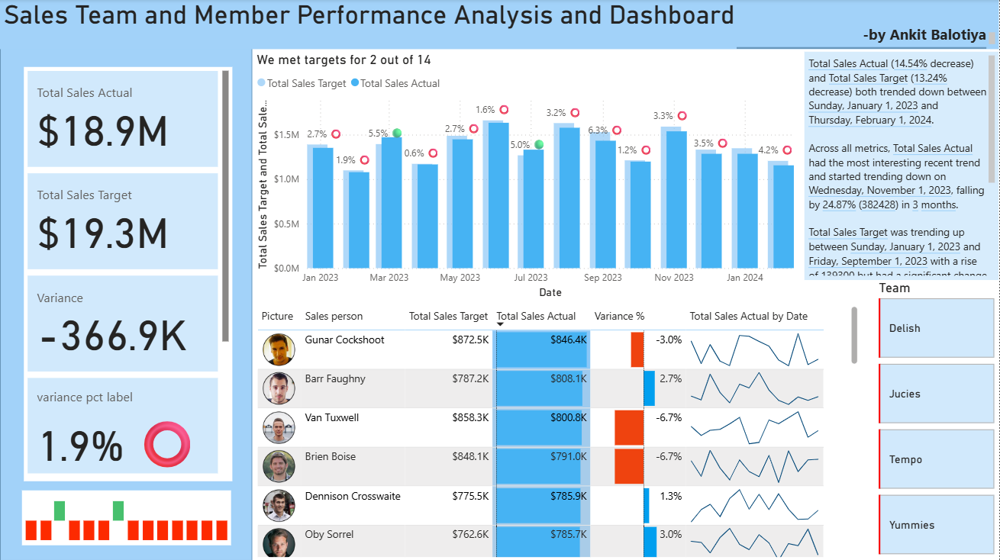
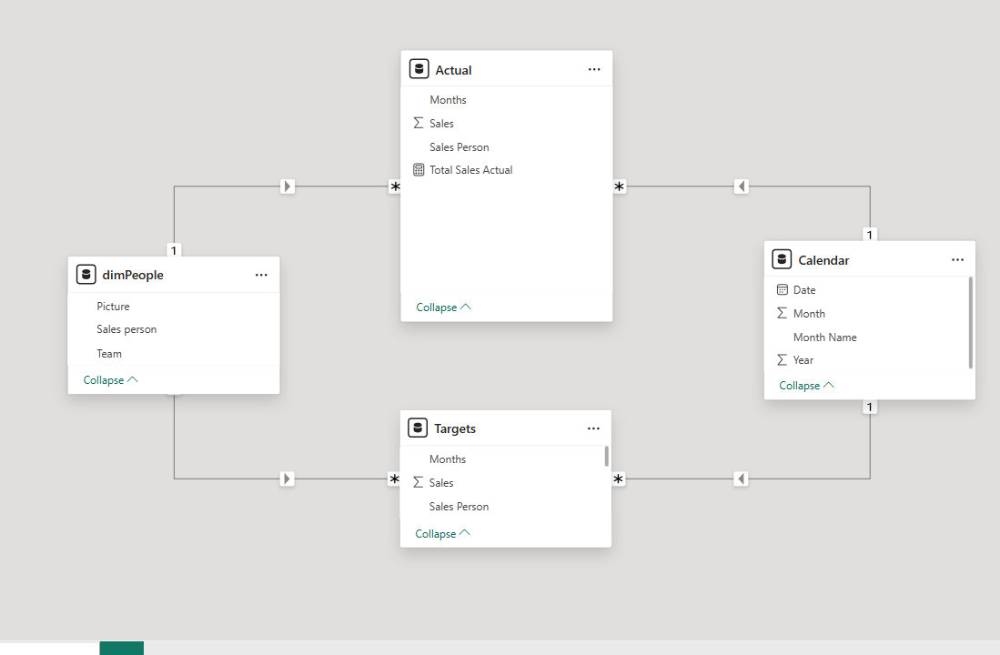

# Sales Team and Member Performance Dashboard


## 📖 Dashboard Overview
This dashboard analyzes **Actual Sales vs. Target Sales** across months, teams, and salespeople. It highlights where we met or missed targets, the variance amount and %, and how performance trends over time. It’s designed for quick C-level insight and deep dive for managers.

**Highlights**
- KPI cards: *Total Sales Actual, Total Sales Target, Variance, Variance %*  
- Monthly *Actual vs. Target* column chart with trend markers and a dynamic title  
- Salesperson table: target, actual, variance %, and mini trend sparkline  
- Team slicer to segment performance by team  
- Narrative/insight panel summarizing month-over-month changes

---

## ❓ Questions We Asked (and Answered)
1. Are we **hitting targets overall** and **by month**?  
2. **Which salespeople** are over/under target? By how much?  
3. What’s the **variance (%)** and where are the biggest gaps?  
4. In **how many months** did we meet target?  
5. Which **teams** need attention?

**Using the dashboard to solve**
- Compare *Actual vs. Target* at a glance.
- Find underperforming months or people fast with variance color cues.
- Use team filters and person drill-ins for targeted coaching actions.
- Track month trend and momentum with sparklines and narrative.

---
## 📊 Dashboard Image


## 🧩 Data Model (ER Diagram)


## ⚙️ DAX Examples 

```DAX
-- Base totals
Total Sales Actual = SUM(Actual[Sales])
Total Sales Target = SUM(Targets[Sales])

-- Variance numbers
Variance = [Total Sales Actual] - [Total Sales Target]
Variance % = DIVIDE([Variance], [Total Sales Target])

-- Label with emoji for KPI card
variance pct label = 
    VAR up = "🟢"
    VAR down = "⭕"
    VAR formatted_var_pct = FORMAT(ABS([Variance %]), "0.0%")
    RETURN formatted_var_pct & " " & IF([Variance %] > 0, up, down)

-- Month count title for the main chart
Month Target Reached = 
    VAR months_with_target_reached =
        FILTER(ALL('Calendar'), [Variance] > 0)
    RETURN COUNTROWS(months_with_target_reached)

Trend Chart Title =
    VAR month_count = COUNTROWS('Calendar')
    RETURN
        "We met targets for " & [Month Target Reached] & " out of " & month_count

-- Status for conditional formatting (bars/cards)
Target Status = IF([Variance] > 0, 1, -1)

-- YTD/MTD example (adjust to YTD if needed)
YTD Sales Actual =
    CALCULATE([Total Sales Actual], DATESMTD('Calendar'[Date]))
```
## 🔑 KPI Explanations

- **Total Sales Actual** – Sum of realized sales.  
- **Total Sales Target** – Planned sales goal.  
- **Variance** – Actual minus Target; negative means shortfall.  
- **Variance %** – Variance relative to Target (normalizes by goal size).  
- **Trend Chart Title** – Dynamic sentence summarizing months that met target.  
- **Target Status** – Used for conditional formatting (green/red).  

---

## 📌 Key Takeaways (from current snapshot)

- Only **2 of 14 months** hit target (dynamic via DAX).  
- Overall performance is **~1.9% below target** with a **-$366.9K** gap.  
- Mixed individual performance; some reps exceed, others miss by 3–7%.  
- Noticeable **downtrend after Nov 2023**; requires pipeline focus and coaching.  

> seen in the dashboard too

---

## 🧠 Interactivity & Build Notes

- **Data model**: Star schema with `Calendar` and `dimPeople` as dimensions; `Actual` and `Targets` as fact tables joined by Month/Date and Sales Person.  
- **Slicers/Filters**: Team slicer + cross-filtering across visuals.  
- **Conditional formatting**: Variance bars and emoji labels for instant readability.  
- **Drill-through**: Person-level page for deep dives (optional).  
- **Dynamic text**: DAX-driven titles and narrative help users interpret trends.  

---

## 🚀 How to Use

1. Open the PBIX and refresh data sources for `Actual`, `Targets`, and `Calendar`.  
2. Check relationships: `Calendar` → (Actual, Targets) on Date/Month; `dimPeople` → (Actual, Targets) on Sales Person.  
3. Paste the DAX into a **Measures** table.  
4. Publish to Power BI Service and share with your team.  


